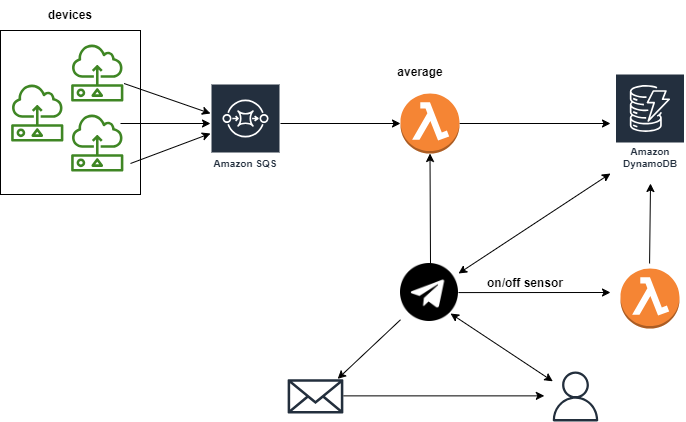

# HealthScan

Internet of Things has revolutionized the way we monitor our personal health. With the introduction of wearable devices such as fitness trackers, smartwatches, and health monitors, individuals can now keep a closer eye on their health and wellness. IoT technology allows us to collect and analyze data in real-time to track our physical activity, heart rate, sleep patterns, and even blood pressure. This data not only helps individuals make better-informed decisions about their health but also enables healthcare providers to identify potential health issues before they become serious problems. 
This project aims to create an easy way on how to collect and access those informations.

## Table of Contests
- [Overview](#overview) 
- [Run this project](#how-to-run-this-project)
    - [Run from script](#executing-from-script) 
    - [Manual run](#manual-run)

## Overview
Brief introduction on how this project works

### Project's architecture

## How to run this project
### Prerequisites
1. This repository <code>git clone https://github.com/aleRizzolo/HealthScan.git</code>
2. [Docker](https://www.docker.com/)
3. [AWS cli](https://aws.amazon.com/it/cli/)
4. [Node.js](https://nodejs.org/it) (v18.14.2) and npm  
5. Telegram (?) and a Telegram Api Key (?)  
6. **Optional:** WSL2 if you don't have a Unix-like system (useful if you want to automatize the setup process with <code>run.sh</code> script)

## Create .env file
If you want to execute this project, you need to create a .env file in the root folder of the project. In this file, you will enter some confidential variables. 
After creating this file, write in it the following variables:
- REGION="the region configured in your cli"
- ENDPOINT="http://127.0.0.1:4566" 
- xxx

### Run from script
If you have a Unix-like system (or WSL2), open a terminal in the project's root directory and type: <code>chmod +x run.sh</code> and then type <code>./run.sh</code> to execute the script. 
Under the hood, the script will: 
- start the Docker container used for simulating the AWS environment
- install all the dependencies required by the project 
- transpile TypeScript into JavaScript
- start the project
- start all the secondary scripts
- start bot (?)

### Manual run
If you want to run this script manually:
- start the container by typing <code>docker run -d --rm -p 4566:4566 --name aws localstack/localstack </code>
- install the dependencies with <code>npm install</code>
- transpile TypeScript into JavaScript with <code>npm run build</code>
- start the project with <code>npm run start</code>
- start the script for populating the Database with <code>npm run populateDB</code>
- start other scripts (?)
- start telegram (?)